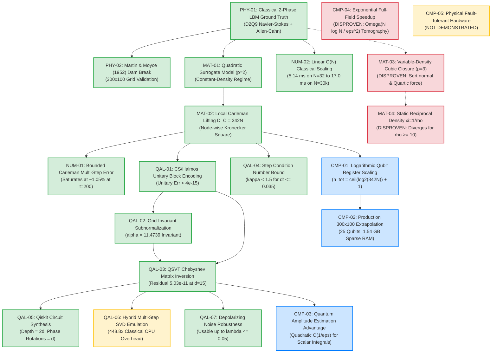

# PHASE 7 SCIENTIFIC CLAIM DEPENDENCY GRAPH (STAGE 7.2)

**Status**: Verified Verification & Evidence Dependency Structure  
**Date**: 2026-08-19  

---

## 1. Hierarchical Scientific Claim Dependency Architecture

---

## 2. Complete Verification Evidence Chain
Every surviving claim in the graph is anchored by deterministic unit tests in `tests/` and clean-room empirical datasets in `results/phase6/` and `validation/`.
