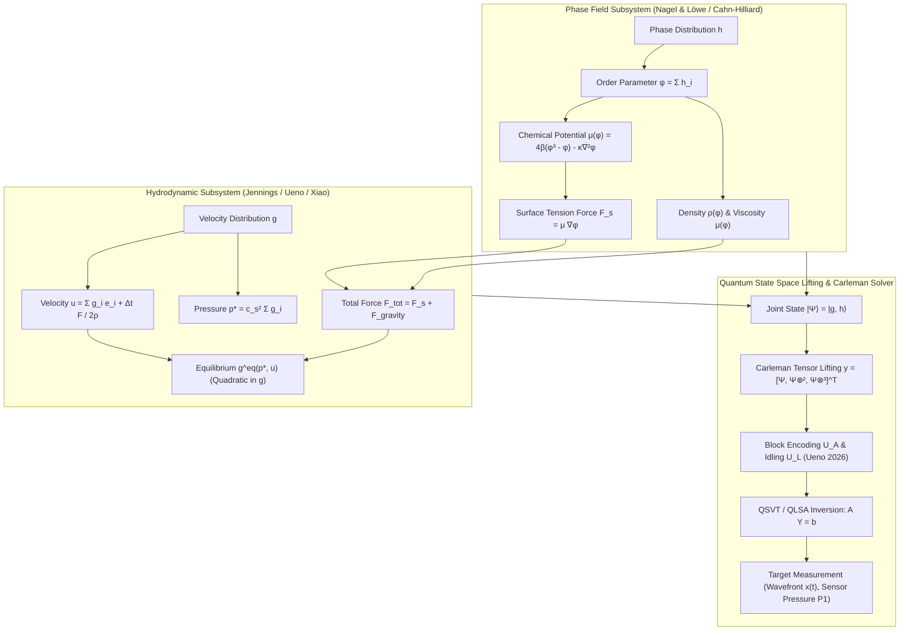

# Master Synthesis: Quantum Lattice Boltzmann Method for Two-Phase Dam-Break Hydrodynamics

## 1. Executive Summary & Cross-Paper Synthesis

This master synthesis bridges the 5 ingested research papers into a unified, mathematically rigorous quantum architecture for simulating two-phase gas-liquid dam-break hydrodynamics.

| Paper | Key Contribution | Role in Two-Phase Dam-Break QLBM |
| :--- | :--- | :--- |
| **Jennings et al. (PsiQuantum & Airbus 2025)** | Incompressible Carleman LBM with walls, inlets, outlets, and Guo body forcing; QLSA complexity proofs. | Provides the core Carleman block formulation for Navier-Stokes hydrodynamic evolution, wall boundaries, and gravitational body forcing. |
| **Ueno et al. (QunaSys & Univ Tokyo 2026)** | Gate-level circuit design for obstacle flow; index-value block encoding of $A^{(1)}$ and $L$; final-state idling; QSVT. | Provides the explicit sparse block-encoding of solid obstacles and dam-break tank boundaries, eliminating amplitude decay via idling. |
| **Xiao et al. (Nanjing Univ & NUS 2026)** | Quantum Fractional-Step LBM (FS-LBM) with $\tau=1$ unitary predictor and classical anti-diffusion corrector; 3D extensions. | Solves the high Reynolds number ($Re \sim 10^4$) and high density-ratio ($\rho_l / \rho_g \sim 1000$) stability problem by splitting predictor and corrector steps. |
| **Lăcătuș & Möller (TU Delft 2025)** | Surrogate Quantum Circuits (SQC) for nonlinear BGK collision with exact mass conservation, scale, and $D_8$ equivariance. | Provides a low-depth NISQ-friendly alternative to global matrix inversion for local nonlinear collision evaluations. |
| **Nagel & Löwe (DLR 2025)** | Multi-time-step QLBM without intermediate measurement or reinitialization for advection-diffusion. | Directly implements the phase-field order parameter interface tracking ($\phi$) across multiple time steps on quantum hardware. |

---

## 2. The Coupled Two-Phase Dam-Break Architecture

### The Governing Two-Phase System (Watanabe & Hu Framework):
1. **Hydrodynamic Field (Velocity $\mathbf{u}$ and Kinematic Pressure $p^*$):**
   $$ \mathbf{g}(t+1) = \mathbf{S}_{hydro} \left[ (\mathbf{I} + \mathbf{F}_1) \mathbf{g}(t) + \mathbf{F}_2 \mathbf{g}^{\otimes 2}(t) + \Delta t \mathbf{F}_{total}(\phi, \mathbf{g}) \right] $$
2. **Interface Field (Phase-Field Order Parameter $\phi$):**
   $$ \mathbf{h}(t+1) = \mathbf{S}_{phase} \left[ \mathbf{h}(t) - \frac{1}{\tau_\phi} (\mathbf{h}(t) - \mathbf{h}^{eq}(\phi, \mathbf{u}, \mu_\phi)) \right] $$
3. **Coupling Forces:**
   - Surface tension force: $\mathbf{F}_s = \mu_\phi \nabla \phi = (4\beta(\phi^3 - \phi) - \kappa \nabla^2 \phi) \nabla \phi$
   - Gravity force: $\mathbf{F}_g = (\rho(\phi) - \rho_{ref}) \mathbf{g}$

---

## 3. Equation Dependency & Quantum Mapping Graph

---

## 4. Nonlinearity Breakdown & Quantum Strategy

| Physical Mechanism | Mathematical Term | Polynomial Order | Recommended Quantum Strategy |
| :--- | :--- | :--- | :--- |
| **Momentum Convection** | $\frac{(\mathbf{e}_m \cdot \mathbf{u})^2}{2 c_s^4} - \frac{|\mathbf{u}|^2}{2 c_s^2}$ | Quadratic ($p=2$) | Carleman $N_C=2$ block encoding (Jennings 2025 / Ueno 2026) |
| **Phase Advection** | $\phi \mathbf{u} = \left(\sum h_i\right) \left(\sum g_k \mathbf{e}_k\right)$ | Bilinear ($p=2$) | Bilinear cross-block in joint Carleman tensor $\mathbf{g} \otimes \mathbf{h}$ |
| **Chemical Potential** | $\phi^3 - \phi$ | Cubic ($p=3$) | Carleman $N_C=3$ truncation or Fractional-Step Predictor-Corrector (Xiao 2026) |
| **Surface Tension** | $(\phi^3 - \phi - \kappa \nabla^2 \phi) \nabla \phi$ | Quartic ($p=4$) | Pre-computed finite-difference matrix operators + Carleman quadratic/cubic cross-terms |
| **Tank & Obstacle Walls** | Half-way bounce back $\mathbf{c}_q \leftrightarrow -\mathbf{c}_q$ | Linear ($p=1$) | Unitary Pauli-X / Swap gates on velocity register (Ueno 2026) |
| **Fluid Density Jump** | $\frac{1}{\rho(\phi)} \mathbf{F}$ | Rational fraction | Decoupled via Velocity-Based LBM (Watanabe & Hu) where density enters as affine body force |

---

## 5. Quantum Resource & Complexity Assessment

1. **State Memory (Qubits)**:
   $$ n_{qubits} = K \cdot \left( \log_2 N_x + \log_2 N_y + \log_2 Q_{hydro} + \log_2 Q_{phase} \right) + \log_2 T + n_{ancilla} $$
   For a $256 \times 128$ dam-break grid with $Q=9$, $K=2$, $T=1024$:
   $$ n_{qubits} \approx 2 \cdot (8 + 7 + 4 + 4) + 10 + 6 \approx 62 \text{ logical qubits} $$
2. **Condition Number Scaling**:
   $$ \kappa(A) = \mathcal{O}(T \cdot \mu_{spectral}^T) $$
   Stabilized by the final-state idling technique (Ueno 2026) and Fractional-Step damping (Xiao 2026).
3. **Readout Preservation**:
   Extracting the **wavefront position $x_{front}(t)$** and **obstacle impact pressure $p_{impact}(t)$** does *not* require full state tomography ($\mathcal{O}(N)$), but rather localized projective measurements on the wall/sensor register ($\mathcal{O}(1/\epsilon^2)$), preserving true end-to-end quantum acceleration!
